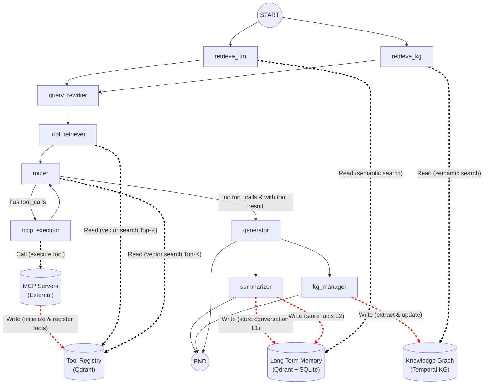
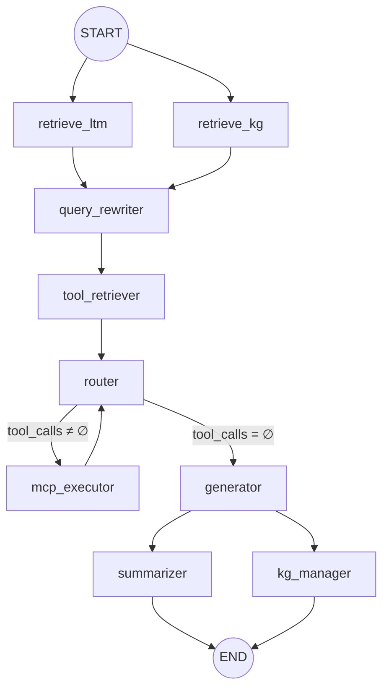

# Architecture Deep Dive

本文档面向团队内部接手工程师，详细阐述 Smart Router Agent 的核心架构设计思想、数据流转路径及关键实现细节。

---

## 1. 总体架构图



---

## 2. 三层记忆架构

### 2.1 架构总览

| 层级 | 存储 | 生命周期 | 写入时机 | 读取时机 |
|------|------|----------|----------|----------|
| **STM** (Short-Term Memory) | LangGraph MemorySaver (内存) | 单次会话 (thread_id 内) | 每个节点输出自动累积 | router / generator 构建 prompt |
| **LTM** (Long-Term Memory) | L1: SQLite `conversations` 表<br/>L2: Qdrant `ltm_facts` collection | 永久 | `summarizer` 节点后处理 | `retrieve_ltm` 节点 |
| **Temporal KG** (时序知识图谱) | SQLite `kg_nodes` + `kg_relations` 表<br/>Qdrant `kg_nodes` collection | 永久 (逻辑失效) | `kg_manager` 节点后处理 | `retrieve_kg` 节点 |

### 2.2 STM — 短期记忆

由 LangGraph `MemorySaver` 自动管理。`AgentState.messages` 使用 `Annotated[list, operator.add]`，每个节点返回的新消息自动追加。同一 `thread_id` 下跨轮次累积，无需手动维护。

### 2.3 LTM — 长期记忆 (双层设计)

```
对话结束
  │
  ▼
┌─────────────────────────────────────────────┐
│ summarizer 节点                              │
│  1. store_conversation() → L1 (SQLite)      │
│  2. extract_facts(LLM) → 原子化事实          │
│  3. store_facts() → L2 (Qdrant + dedup)     │
└─────────────────────────────────────────────┘

新一轮对话开始
  │
  ▼
┌─────────────────────────────────────────────┐
│ retrieve_ltm 节点                            │
│  query → embedding → Qdrant 语义 Top-K       │
│  (user_id filter + min_score 0.3)           │
│  → 返回相关事实字符串列表                      │
└─────────────────────────────────────────────┘
```

**去重机制**：`store_facts()` 在写入前查询 Qdrant，若已存在相似度 > 0.95 的事实则跳过。

**溯源能力**：每条 L2 事实关联 `source_conversation_id`，可追溯到 L1 原始对话。

### 2.4 Temporal KG — 时序知识图谱

**Schema 规范：**
- `active_start`: 写入时的系统时间
- `active_end`: 默认 `NULL` (当前有效)；失效时设为当前时间
- 查询规则: `active_start <= reference_time < (active_end or ∞)`
- **严禁物理删除**，只做逻辑失效

**检索策略 — 语义种子 + 受限图扩展：**

```
query
  │
  ▼ embedding
Qdrant Top-K 匹配入口实体 (score > 0.35)
  │
  ▼ 1-hop 扩展 (双向边)
SQLite 出边 + 入边 → 1-hop 邻居
  │
  ▼ 检查邻居与 query 相似度
if 存在高相似邻居 → 追加 1-hop (共 2-hop)
  │
  ▼ 硬上限 MAX_HOPS = 2
返回子图: seed_entities + subgraph_nodes + subgraph_relations
```

**冲突处理**：对同一 `(source, relation_type)` 组合，若 target 变化，旧关系自动逻辑失效。

---

## 3. 两阶段路由与执行 (RAG for Tools)

### 3.1 概念

传统 Agent 将所有工具一次性绑定到 LLM context，当工具数量超过 20~50 个时，prompt 膨胀导致精度骤降。

本系统采用 **RAG for Tools** 范式：

```
阶段 1: 向量检索     阶段 2: LLM 决策
─────────────────   ─────────────────
Contextualized      Top-K 候选
Query               (含完整 schema)
    │                    │
    ▼                    ▼
Qdrant 语义 Top-3    LLM.bind_tools(candidates)
(384d cosine)        → AIMessage (有/无 tool_calls)
```

### 3.2 详细流程

1. **query_rewriter** — 融合 STM + LTM + KG 上下文，改写原始 query 为语义丰富的 contextualized query
2. **tool_retriever** — 以 contextualized query 做 Qdrant `query_points`，返回 Top-3 工具（基于 `search_document` embedding）
3. **router** — 将 Top-3 工具的完整 JSON Schema 通过 `llm.bind_tools()` 提供给 LLM，由 LLM 自主决定：
   - 输出 `AIMessage` 含 `tool_calls` → 路由到 `mcp_executor`
   - 输出纯文本 → 路由到 `generator`
4. **mcp_executor** — 解析 `tool_calls`，通过 `ToolRegistry` 查找所属 MCP Server，调用 `MCPClientFactory.execute_tool()` 并发执行
5. **回流机制** — `mcp_executor` 执行完毕后无条件回流到 `router`，支持多轮串行工具调用（如先查天气再查航班），直到 LLM 判定不再需要工具

### 3.3 ToolRegistry 无状态设计

```
ToolDefinition {
    name:            "get_weather"
    mcp_server_name: "Weather_Server"
    schema:          { type: object, properties: {...}, required: [...] }
    search_document: "查询指定地点的天气预报..."  ← 用于 embedding
}
```

所有数据存储在 Qdrant `tool_registry` collection 中：
- **向量**: `search_document` 的 384d embedding
- **Payload**: 完整 `ToolDefinition` 序列化
- **Point ID**: `uuid5(NAMESPACE_DNS, "tool:{name}")` — 确定性 ID，保证 upsert 幂等

> **Note**: 进程重启后无需重新注册工具。Qdrant 本地文件存储已持久化全部信息。

---

## 4. MCP 通信机制

### 4.1 协议栈

```
┌───────────────────────────────────────────────┐
│ Agent 数据面 (mcp_executor)                    │
├───────────────────────────────────────────────┤
│ MCPClientFactory (传输路由器)                   │
│   ├── http/sse → HttpMCPClient                │
│   └── stdio → (预留)                          │
├───────────────────────────────────────────────┤
│ HttpMCPClient                                 │
│   ├── _ensure_session() — 懒加载              │
│   ├── _idle_cleanup_loop() — 空闲回收         │
│   └── _with_retry() — 防雪崩重试              │
├───────────────────────────────────────────────┤
│ mcp.client.session.ClientSession              │
│   ├── initialize() — JSON-RPC 握手            │
│   ├── list_tools() → ListToolsResult          │
│   └── call_tool() → CallToolResult            │
├───────────────────────────────────────────────┤
│ mcp.client.sse.sse_client (SSE 传输)          │
│   └── httpx EventSource 长连接                │
└───────────────────────────────────────────────┘
         ▼ HTTP/SSE ▼
┌───────────────────────────────────────────────┐
│ MCP Server (FastAPI + SseServerTransport)      │
│   ├── /weather/sse — SSE 端点                  │
│   ├── /weather/messages — JSON-RPC POST        │
│   └── mcp.server.Server (list_tools/call_tool) │
└───────────────────────────────────────────────┘
```

### 4.2 连接池管理策略

| 策略 | 参数 | 说明 |
|------|------|------|
| **懒加载** | — | `register_server()` 仅存配置；首次 RPC 调用时才建立 SSE 长连接 |
| **空闲回收** | `IDLE_TTL = 600s`<br/>`CLEANUP_INTERVAL = 60s` | 后台协程每 60 秒扫描，超 10 分钟无活跃的连接主动关闭 |
| **防雪崩重试** | Jitter `[0.1, 0.5]s` | 首次失败后驱逐坏连接、随机等待、重新建连重试一次 |
| **优雅退出** | `close_all()` | 关闭全部 `AsyncExitStack`，释放所有 SSE 连接 |

### 4.3 Mock MCP Server 实现细节

`mock_mcp_servers.py` 是一个单进程多服务的 DDD 网关：

- **FastAPI** 提供 REST 端点 (`/admin/upgrade`, `/health`)
- **Raw ASGI App** 挂载 SSE 端点 (`/weather/sse`, `/travel/sse`)，绕过 FastAPI 中间件避免 SSE 流被拦截
- **DynamicMCPServer** 封装 `mcp.server.Server`，支持运行时 `add_tool()` 动态注册

> **Warning**: FastAPI/Starlette 的 `ServerErrorMiddleware` 会包裹 ASGI `send` 回调，导致 `EventSourceResponse` 无法正常流式推送。因此 SSE 端点必须使用 `app.mount(path, raw_asgi_function)` 方式挂载，绝不可使用 `@app.get()` 装饰器。

---

## 5. LangGraph StateGraph 编排

### 5.1 完整节点拓扑



### 5.2 节点职责表

| # | 节点 | 类型 | 输入 | 输出 |
|---|------|------|------|------|
| 1 | `retrieve_ltm` | 并行 | messages, user_id | long_term_memory: List[str] |
| 2 | `retrieve_kg` | 并行 | messages, user_id | kg_context: List[str] |
| 3 | `query_rewriter` | Fan-in | messages, LTM, KG | contextualized_query: str |
| 4 | `tool_retriever` | 串行 | contextualized_query | — (副作用：候选工具已在 Qdrant 中准备好) |
| 5 | `router` | 决策 | messages, LTM, KG, tools | messages += [AIMessage] |
| 6 | `mcp_executor` | 执行 | AIMessage.tool_calls | messages += [ToolMessage...] |
| 7 | `generator` | 生成 | 全部上下文 + ToolMessages | response: str, messages += [AIMessage] |
| 8 | `summarizer` | 后处理 | messages, user_id | — (副作用：写入 LTM) |
| 9 | `kg_manager` | 后处理 | messages, user_id | — (副作用：更新 KG) |

### 5.3 条件边逻辑

```python
def _route_after_router(state: AgentState) -> str:
    # 检查最后一条 AIMessage 是否包含 tool_calls
    for m in reversed(state["messages"]):
        if isinstance(m, AIMessage):
            if getattr(m, 'tool_calls', None):
                return "mcp_executor"
            break
    return "generator"
```

---

## 6. 数据持久化拓扑

```
┌───────────────────────────────────────────────────┐
│                  Qdrant (Local File)               │
│                                                   │
│  ltm_facts (384d, COSINE)                         │
│    → payload: {user_id, fact, source_id, time}    │
│                                                   │
│  kg_nodes (384d, COSINE)                          │
│    → payload: {user_id, entity, entity_type}      │
│                                                   │
│  tool_registry (384d, COSINE)                     │
│    → payload: {tool_name, mcp_server_name,        │
│                schema_json, search_document}       │
└───────────────────────────────────────────────────┘

┌───────────────────────────────────────────────────┐
│                SQLite (agent_data.db)              │
│                                                   │
│  conversations (L1 原始对话)                       │
│    id | user_id | thread_id | role | content | ts │
│                                                   │
│  kg_nodes (时序节点)                               │
│    id | user_id | entity | type | props           │
│    | active_start | active_end                    │
│                                                   │
│  kg_relations (时序关系)                           │
│    id | user_id | source | target | relation_type │
│    | props | active_start | active_end            │
└───────────────────────────────────────────────────┘
```

---

## 7. 生产环境防坑指南

> **Note — 企业代理穿透**
> 企业网络的 HTTP_PROXY (如 `127.0.0.1:8080` / CNTLM 3128) 会拦截 localhost 流量。必须确保环境变量 `NO_PROXY` 包含 `127.0.0.1,localhost`。代码中已在 `mcp_client.py` 模块级和 `demo_main.py` 入口处做了自动注入。

> **Note — SSE 长连接与负载均衡**
> SSE 连接是有状态的长连接。若使用 Nginx/K8s Ingress 做负载均衡，必须配置 sticky session 或将 MCP Server 置于客户端可直连的网络区域。`Idle TTL = 600s` 可按需调整。

> **Note — Embedding 模型 OOM 防御**
> `paraphrase-multilingual-MiniLM-L12-v2` 加载后占用约 500MB 内存。在容器化部署时建议设置 `resources.requests.memory: 1Gi`。单例模式确保不会重复加载。

> **Note — Windows 子进程编码**
> Windows 默认 cp1252 编码无法处理中文输出。`demo_main.py` 中已通过 `PYTHONIOENCODING=utf-8` 环境变量解决。

> **Note — Qdrant 本地模式并发限制**
> Qdrant local file mode 使用 SQLite-backed storage，写入时有全局锁。生产高并发场景建议切换到 Qdrant Server 模式 (`QdrantClient(url="http://qdrant:6333")`)。
