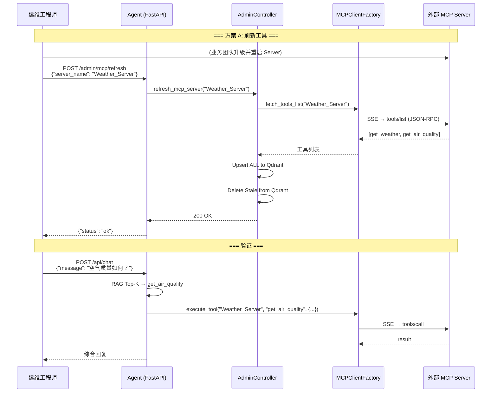

# Operations Manual — 运维与热插拔操作手册

本文档面向运维工程师和接手同事，说明如何在**零停机**条件下对系统进行 MCP Server 管理、工具热插拔和 Prompt 热加载。

---

## 1. 系统端口规划

| 服务 | 默认端口 | 说明 |
|------|----------|------|
| Smart Router Agent (FastAPI) | 8100 | 管理 + 对话 REST API |
| Mock MCP Server (演示) | 8200 | 开发测试用 MCP Server（Weather + Travel） |
| 外部 MCP Server (生产) | 自定义 | 各业务团队独立部署 |

---

## 2. Admin REST API 接口一览

| 方法 | 路径 | 功能 |
|------|------|------|
| `POST` | `/admin/mcp/register` | 注册全新 MCP Server |
| `POST` | `/admin/mcp/refresh` | 刷新现有 Server 工具列表 |
| `POST` | `/admin/prompts/reload` | 热加载 Prompt 配置 |
| `GET` | `/admin/health` | 健康检查 |
| `POST` | `/api/chat` | 对话（生产模式下可用） |

---

## 3. 方案 A — 现有 MCP Server 升级（最常见场景）

**场景**：业务团队在已接入的 Weather_Server 中新增了 `get_air_quality` 工具。

### Step 1: 业务团队升级并重启其 MCP Server

业务团队在自己的 MCP Server 代码中添加新工具定义和处理逻辑，然后重启服务。Agent 侧无需任何变更。

### Step 2: 运维调用 Agent 的刷新接口

```bash
curl -X POST http://127.0.0.1:8100/admin/mcp/refresh \
  -H "Content-Type: application/json" \
  -d '{"server_name": "Weather_Server"}'
```

**预期响应：**
```json
{"status": "ok", "message": "Server 'Weather_Server' refreshed"}
```

**内部执行逻辑：**
1. `AdminController.refresh_mcp_server("Weather_Server")`
2. 通过 SSE Client 重新拉取该 Server 的 `tools/list`
3. **Upsert ALL** — 将获取到的全部工具更新到 Qdrant（新增 + 覆盖变更 schema）
4. **Delete Stale** — 若本地有某工具但远端已移除，从 Qdrant 中删除
5. 下一次用户对话即可命中新工具

> **Note**: 刷新操作 **不会中断** 正在进行的对话。已建立的 SSE Session 会在空闲 TTL 后自动重建。

---

## 4. 方案 B — 接入全新 MCP Server

**场景**：公司新上线了一个 HR 服务 (`HR_Server`)，需要接入 Agent。

### Step 1: 确认新 MCP Server 已部署并可达

```bash
# 验证 SSE 端点可访问
curl http://hr-service.internal:9000/sse
# 应返回 SSE event stream (text/event-stream)
```

### Step 2: 通过 Admin API 注册

```bash
curl -X POST http://127.0.0.1:8100/admin/mcp/register \
  -H "Content-Type: application/json" \
  -d '{
    "server_name": "HR_Server",
    "connection_config": {
      "transport": "http",
      "url": "http://hr-service.internal:9000/sse"
    }
  }'
```

**预期响应：**
```json
{"status": "ok", "message": "Server 'HR_Server' registered"}
```

**内部执行逻辑：**
1. `MCPClientFactory.register_server("HR_Server", config)` — 存储连接配置
2. 首次 `fetch_tools_list` 触发懒加载：建立 SSE 长连接 → JSON-RPC 握手
3. 拉取 `tools/list` → 获得全部工具定义
4. 计算每个工具 `description` 的 embedding → 持久化到 Qdrant `tool_registry`
5. 即刻生效，无需重启

### Step 3 (可选): 持久化到配置文件

若希望进程重启后自动加载该 Server，需更新 `config/mcp_servers_config.json`：

```json
{
  "mcpServers": {
    "Weather_Server": {
      "transport": "http",
      "url": "http://127.0.0.1:8200/weather/sse"
    },
    "Travel_Server": {
      "transport": "http",
      "url": "http://127.0.0.1:8200/travel/sse"
    },
    "HR_Server": {
      "transport": "http",
      "url": "http://hr-service.internal:9000/sse"
    }
  }
}
```

---

## 5. Prompt 热加载

当需要调整 Router / Generator / Summarizer 等节点的 Prompt 模板时：

### Step 1: 编辑 prompts.yaml

```bash
vim smart_router_agent/config/prompts.yaml
```

### Step 2: 调用热加载接口

```bash
curl -X POST http://127.0.0.1:8100/admin/prompts/reload
```

**预期响应：**
```json
{"status": "ok", "message": "Prompts reloaded"}
```

**内部执行逻辑：**
- `PromptLoader.reload()` 使用 `RLock` 线程安全地重新读取 YAML 文件
- 立即生效于后续所有节点调用，无需重启进程

> **Note**: 热加载 **不影响** 正在执行中的请求。使用 `RLock` 保证并发读写安全。

---

## 6. 对话接口使用示例

```bash
# 单轮对话
curl -X POST http://127.0.0.1:8100/api/chat \
  -H "Content-Type: application/json" \
  -d '{
    "message": "我下周要去上海出差，天气怎么样？",
    "user_id": "zhangsan",
    "thread_id": "session_001"
  }'
```

**预期响应：**
```json
{
  "thread_id": "session_001",
  "response": "根据天气预报，上海下周..."
}
```

**多轮对话**：保持相同 `thread_id` 即可共享 STM 上下文。

---

## 7. 健康检查

```bash
curl http://127.0.0.1:8100/admin/health
```

```json
{"status": "healthy"}
```

可配合 K8s `livenessProbe` / `readinessProbe` 使用。

---

## 8. 故障排查 Checklist

### 8.1 Agent 启动失败

| 症状 | 排查 |
|------|------|
| `ModuleNotFoundError: No module named 'mcp'` | 检查 Python 版本 ≥ 3.10，检查 `pip list \| grep mcp` |
| `FileNotFoundError: prompts.yaml` | 确认 `config/prompts.yaml` 存在，`BASE_DIR` 路径正确 |
| `connect_error` on MCP Server | 确认 MCP Server 已启动且端口可达；检查 `NO_PROXY` 设置 |

### 8.2 工具调用失败

| 症状 | 排查 |
|------|------|
| `未知工具: xxx` | 工具未注册，执行 `POST /admin/mcp/refresh` |
| `execute_tool timeout` | MCP Server 可能宕机；检查 SSE 端点是否可达 |
| 工具返回 `执行失败，请重新检查参数` | 检查 LLM 生成的参数是否符合工具 schema |

### 8.3 SSE 连接问题

| 症状 | 排查 |
|------|------|
| `500 Internal Server Error` on `/sse` | MCP Server 的 SSE 端点可能被中间件拦截。确保使用 raw ASGI mount |
| 连接频繁断开 | 检查 Nginx/LB 的 `proxy_read_timeout`，建议设置 ≥ 600s |
| 所有请求走代理超时 | 确认 `NO_PROXY` 包含 `127.0.0.1,localhost` |

---

## 9. 关键运维参数

| 参数 | 位置 | 默认值 | 说明 |
|------|------|--------|------|
| `IDLE_TTL` | `tools/mcp_client.py` | 600s | SSE 连接空闲超时 |
| `CLEANUP_INTERVAL` | `tools/mcp_client.py` | 60s | 连接池扫描间隔 |
| `MAX_HOPS` | `config/config.py` | 2 | KG 图扩展硬上限 |
| `SIMILARITY_THRESHOLD` | `config/config.py` | 0.35 | 语义匹配最低阈值 |
| `TOP_K` | `config/config.py` | 5 | 检索结果数量 |
| Tool retrieval Top-K | `core/nodes.py` (router) | 3 | 候选工具绑定数量 |

---

## 10. 完整操作流程图



---

## 11. 安全注意事项

- **API Key 管理**：当前 Azure OpenAI API Key 硬编码在 `config/config.py` 中，生产环境应迁移至环境变量或 Vault。
- **Admin API 鉴权**：当前 Admin 接口无认证。生产部署应添加 API Key / OAuth2 中间件。
- **MCP Server 信任边界**：`mcp_executor` 会将 LLM 生成的参数透传给外部 Server。应在 Server 侧做参数校验。
