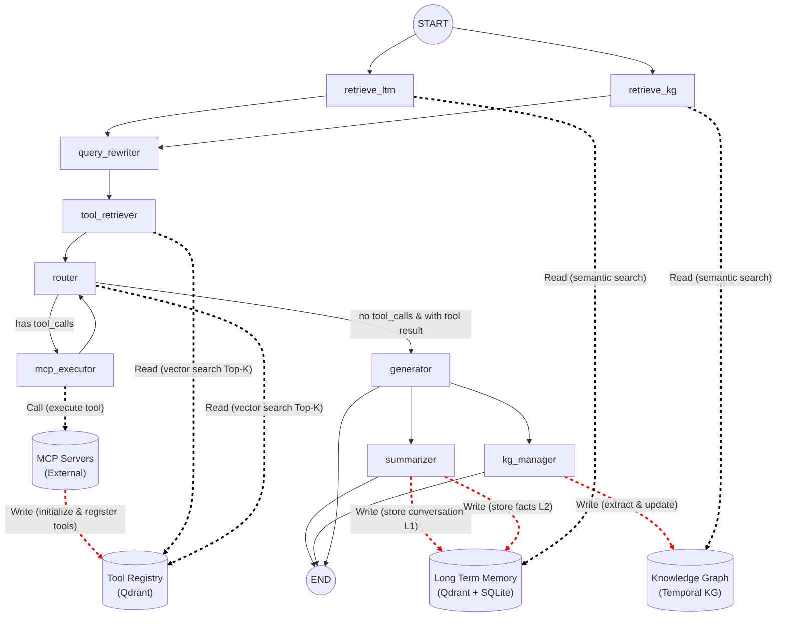
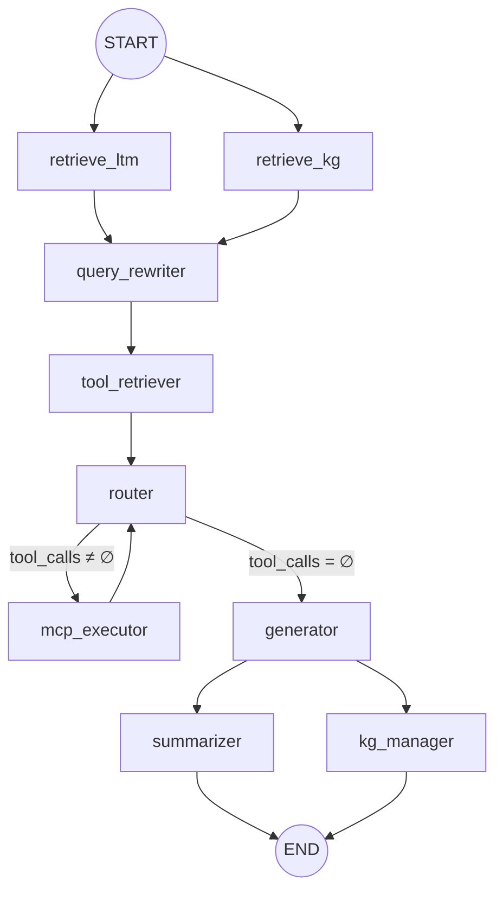

# Architecture Deep Dive

This document is intended for internal team members taking over the project, providing a detailed explanation of the core architectural design philosophy, data flow paths, and key implementation details of Smart Router Agent.

---

## 1. High-Level Architecture Diagram



---

## 2. Three-Layer Memory Architecture

### 2.1 Architecture Overview

| Layer | Storage | Lifecycle | Write Timing | Read Timing |
|-------|---------|-----------|--------------|-------------|
| **STM** (Short-Term Memory) | LangGraph MemorySaver (in-memory) | Single session (within thread_id) | Auto-accumulated by each node output | router / generator prompt construction |
| **LTM** (Long-Term Memory) | L1: SQLite `conversations` table<br/>L2: Qdrant `ltm_facts` collection | Permanent | `summarizer` node post-processing | `retrieve_ltm` node |
| **Temporal KG** (Temporal Knowledge Graph) | SQLite `kg_nodes` + `kg_relations` tables<br/>Qdrant `kg_nodes` collection | Permanent (logical invalidation) | `kg_manager` node post-processing | `retrieve_kg` node |

### 2.2 STM — Short-Term Memory

Automatically managed by LangGraph `MemorySaver`. `AgentState.messages` uses `Annotated[list, operator.add]`, and new messages returned by each node are automatically appended. Accumulated across turns within the same `thread_id`, no manual maintenance required.

### 2.3 LTM — Long-Term Memory (Dual-Layer Design)

```
Conversation ends
  │
  ▼
┌─────────────────────────────────────────────┐
│ summarizer node                              │
│  1. store_conversation() → L1 (SQLite)      │
│  2. extract_facts(LLM) → atomic facts        │
│  3. store_facts() → L2 (Qdrant + dedup)     │
└─────────────────────────────────────────────┘

New conversation round begins
  │
  ▼
┌─────────────────────────────────────────────┐
│ retrieve_ltm node                            │
│  query → embedding → Qdrant semantic Top-K   │
│  (user_id filter + min_score 0.3)           │
│  → returns relevant fact string list         │
└─────────────────────────────────────────────┘
```

**Deduplication Mechanism**: `store_facts()` queries Qdrant before writing; if a fact with similarity > 0.95 already exists, it is skipped.

**Traceability**: Each L2 fact is associated with a `source_conversation_id`, traceable back to the L1 original conversation.

### 2.4 Temporal KG — Temporal Knowledge Graph

**Schema Specification:**
- `active_start`: System time at write
- `active_end`: Default `NULL` (currently valid); set to current time upon invalidation
- Query rule: `active_start <= reference_time < (active_end or ∞)`
- **Physical deletion is strictly prohibited**; only logical invalidation is allowed

**Retrieval Strategy — Semantic Seed + Bounded Graph Expansion:**

```
query
  │
  ▼ embedding
Qdrant Top-K matching entry entities (score > 0.35)
  │
  ▼ 1-hop expansion (bidirectional edges)
SQLite outgoing + incoming edges → 1-hop neighbors
  │
  ▼ Check neighbor similarity to query
if high-similarity neighbor exists → append 1-hop (total 2-hop)
  │
  ▼ Hard limit MAX_HOPS = 2
Returns subgraph: seed_entities + subgraph_nodes + subgraph_relations
```

**Conflict Handling**: For the same `(source, relation_type)` combination, if the target changes, the old relation is automatically logically invalidated.

---

## 3. Two-Phase Routing and Execution (RAG for Tools)

### 3.1 Concept

Traditional Agents bind all tools to the LLM context at once. When tool count exceeds 20~50, prompt bloat causes severe accuracy degradation.

This system adopts the **RAG for Tools** paradigm:

```
Phase 1: Vector Retrieval   Phase 2: LLM Decision
─────────────────────────   ─────────────────────
Contextualized              Top-K candidates
Query                       (with full schema)
    │                            │
    ▼                            ▼
Qdrant Semantic Top-3        LLM.bind_tools(candidates)
(384d cosine)                → AIMessage (with/without tool_calls)
```

### 3.2 Detailed Flow

1. **query_rewriter** — Fuses STM + LTM + KG context, rewrites the original query into a semantically rich contextualized query
2. **tool_retriever** — Uses contextualized query for Qdrant `query_points`, returns Top-3 tools (based on `search_document` embedding)
3. **router** — Provides the full JSON Schema of Top-3 tools to the LLM via `llm.bind_tools()`, letting the LLM autonomously decide:
   - Outputs `AIMessage` with `tool_calls` → routes to `mcp_executor`
   - Outputs plain text → routes to `generator`
4. **mcp_executor** — Parses `tool_calls`, looks up the owning MCP Server via `ToolRegistry`, calls `MCPClientFactory.execute_tool()` for concurrent execution
5. **Loop-back Mechanism** — After `mcp_executor` completes, it unconditionally loops back to `router`, supporting multi-round sequential tool calls (e.g., check weather first, then search flights), until the LLM determines no more tools are needed

### 3.3 ToolRegistry Stateless Design

```
ToolDefinition {
    name:            "get_weather"
    mcp_server_name: "Weather_Server"
    schema:          { type: object, properties: {...}, required: [...] }
    search_document: "Query weather forecast for a specified location..."  ← used for embedding
}
```

All data is stored in the Qdrant `tool_registry` collection:
- **Vector**: 384d embedding of `search_document`
- **Payload**: Full serialized `ToolDefinition`
- **Point ID**: `uuid5(NAMESPACE_DNS, "tool:{name}")` — Deterministic ID, guarantees idempotent upsert

> **Note**: No need to re-register tools after process restart. Qdrant local file storage has already persisted all information.

---

## 4. MCP Communication Mechanism

### 4.1 Protocol Stack

```
┌───────────────────────────────────────────────┐
│ Agent Data Plane (mcp_executor)                │
├───────────────────────────────────────────────┤
│ MCPClientFactory (Transport Router)            │
│   ├── http/sse → HttpMCPClient                │
│   └── stdio → (Reserved)                      │
├───────────────────────────────────────────────┤
│ HttpMCPClient                                 │
│   ├── _ensure_session() — Lazy Init           │
│   ├── _idle_cleanup_loop() — Idle Reclamation │
│   └── _with_retry() — Anti-Stampede Retry     │
├───────────────────────────────────────────────┤
│ mcp.client.session.ClientSession              │
│   ├── initialize() — JSON-RPC Handshake       │
│   ├── list_tools() → ListToolsResult          │
│   └── call_tool() → CallToolResult            │
├───────────────────────────────────────────────┤
│ mcp.client.sse.sse_client (SSE Transport)     │
│   └── httpx EventSource Persistent Connection │
└───────────────────────────────────────────────┘
         ▼ HTTP/SSE ▼
┌───────────────────────────────────────────────┐
│ MCP Server (FastAPI + SseServerTransport)      │
│   ├── /weather/sse — SSE Endpoint              │
│   ├── /weather/messages — JSON-RPC POST        │
│   └── mcp.server.Server (list_tools/call_tool) │
└───────────────────────────────────────────────┘
```

### 4.2 Connection Pool Management Strategy

| Strategy | Parameters | Description |
|----------|------------|-------------|
| **Lazy Init** | — | `register_server()` only stores config; SSE connection established on first RPC call |
| **Idle Reclamation** | `IDLE_TTL = 600s`<br/>`CLEANUP_INTERVAL = 60s` | Background coroutine scans every 60s, proactively closes connections idle for over 10 minutes |
| **Anti-Stampede Retry** | Jitter `[0.1, 0.5]s` | After first failure: evict bad connection, random wait, reconnect and retry once |
| **Graceful Shutdown** | `close_all()` | Closes all `AsyncExitStack` instances, releases all SSE connections |

### 4.3 Mock MCP Server Implementation Details

`mock_mcp_servers.py` is a single-process multi-service DDD gateway:

- **FastAPI** provides REST endpoints (`/admin/upgrade`, `/health`)
- **Raw ASGI App** mounts SSE endpoints (`/weather/sse`, `/travel/sse`), bypassing FastAPI middleware to avoid SSE stream interception
- **DynamicMCPServer** wraps `mcp.server.Server`, supports runtime `add_tool()` dynamic registration

> **Warning**: FastAPI/Starlette's `ServerErrorMiddleware` wraps the ASGI `send` callback, preventing `EventSourceResponse` from streaming properly. Therefore, SSE endpoints must be mounted using `app.mount(path, raw_asgi_function)` — never use `@app.get()` decorators.

---

## 5. LangGraph StateGraph Orchestration

### 5.1 Complete Node Topology



### 5.2 Node Responsibility Table

| # | Node | Type | Input | Output |
|---|------|------|-------|--------|
| 1 | `retrieve_ltm` | Parallel | messages, user_id | long_term_memory: List[str] |
| 2 | `retrieve_kg` | Parallel | messages, user_id | kg_context: List[str] |
| 3 | `query_rewriter` | Fan-in | messages, LTM, KG | contextualized_query: str |
| 4 | `tool_retriever` | Sequential | contextualized_query | — (side effect: candidates ready in Qdrant) |
| 5 | `router` | Decision | messages, LTM, KG, tools | messages += [AIMessage] |
| 6 | `mcp_executor` | Execution | AIMessage.tool_calls | messages += [ToolMessage...] |
| 7 | `generator` | Generation | all context + ToolMessages | response: str, messages += [AIMessage] |
| 8 | `summarizer` | Post-processing | messages, user_id | — (side effect: writes to LTM) |
| 9 | `kg_manager` | Post-processing | messages, user_id | — (side effect: updates KG) |

### 5.3 Conditional Edge Logic

```python
def _route_after_router(state: AgentState) -> str:
    # Check if the last AIMessage contains tool_calls
    for m in reversed(state["messages"]):
        if isinstance(m, AIMessage):
            if getattr(m, 'tool_calls', None):
                return "mcp_executor"
            break
    return "generator"
```

---

## 6. Data Persistence Topology

```
┌───────────────────────────────────────────────────┐
│                  Qdrant (Local File)               │
│                                                   │
│  ltm_facts (384d, COSINE)                         │
│    → payload: {user_id, fact, source_id, time}    │
│                                                   │
│  kg_nodes (384d, COSINE)                          │
│    → payload: {user_id, entity, entity_type}      │
│                                                   │
│  tool_registry (384d, COSINE)                     │
│    → payload: {tool_name, mcp_server_name,        │
│                schema_json, search_document}       │
└───────────────────────────────────────────────────┘

┌───────────────────────────────────────────────────┐
│                SQLite (agent_data.db)              │
│                                                   │
│  conversations (L1 Raw Conversations)             │
│    id | user_id | thread_id | role | content | ts │
│                                                   │
│  kg_nodes (Temporal Nodes)                        │
│    id | user_id | entity | type | props           │
│    | active_start | active_end                    │
│                                                   │
│  kg_relations (Temporal Relations)                │
│    id | user_id | source | target | relation_type │
│    | props | active_start | active_end            │
└───────────────────────────────────────────────────┘
```

---

## 7. Production Pitfall Guide

> **Note — Enterprise Proxy Bypass**
> Enterprise network HTTP_PROXY (e.g., `127.0.0.1:8080` / CNTLM 3128) will intercept localhost traffic. You must ensure the `NO_PROXY` environment variable includes `127.0.0.1,localhost`. The code already auto-injects this at module level in `mcp_client.py` and at the entry point of `demo_main.py`.

> **Note — SSE Persistent Connections and Load Balancing**
> SSE connections are stateful persistent connections. If using Nginx/K8s Ingress for load balancing, you must configure sticky sessions or place MCP Servers in a network zone directly accessible by the client. `Idle TTL = 600s` can be adjusted as needed.

> **Note — Embedding Model OOM Defense**
> `paraphrase-multilingual-MiniLM-L12-v2` occupies approximately 500MB of memory after loading. For containerized deployments, it is recommended to set `resources.requests.memory: 1Gi`. The singleton pattern ensures the model is never loaded more than once.

> **Note — Windows Subprocess Encoding**
> Windows defaults to cp1252 encoding which cannot handle CJK character output. This is resolved in `demo_main.py` via the `PYTHONIOENCODING=utf-8` environment variable.

> **Note — Qdrant Local Mode Concurrency Limitations**
> Qdrant local file mode uses SQLite-backed storage with a global write lock. For high-concurrency production scenarios, it is recommended to switch to Qdrant Server mode (`QdrantClient(url="http://qdrant:6333")`).
