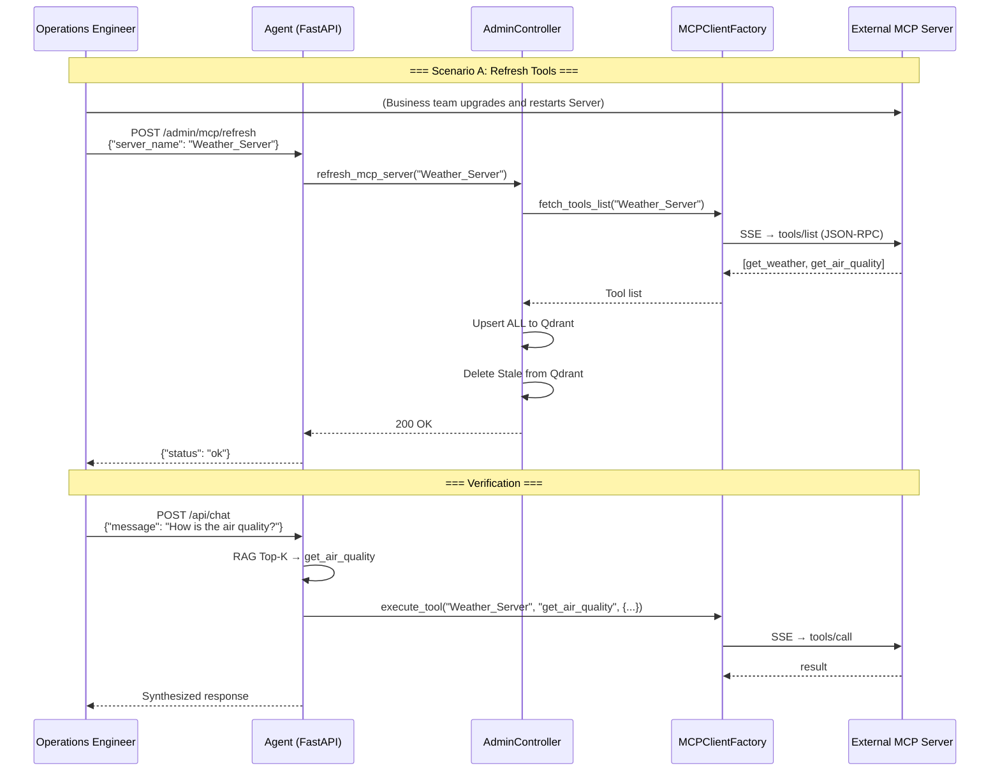

# Operations Manual — Hot-Swap & Administration Guide

This document is intended for operations engineers and team members taking over the project, explaining how to perform MCP Server management, tool hot-swapping, and Prompt hot-reloading under **zero-downtime** conditions.

---

## 1. System Port Planning

| Service | Default Port | Description |
|---------|--------------|-------------|
| Smart Router Agent (FastAPI) | 8100 | Management + Chat REST API |
| Mock MCP Server (Demo) | 8200 | Dev/test MCP Server (Weather + Travel) |
| External MCP Server (Production) | Custom | Independently deployed by each business team |

---

## 2. Admin REST API Overview

| Method | Path | Function |
|--------|------|----------|
| `POST` | `/admin/mcp/register` | Register a new MCP Server |
| `POST` | `/admin/mcp/refresh` | Refresh existing Server tool list |
| `POST` | `/admin/prompts/reload` | Hot-reload Prompt configuration |
| `GET` | `/admin/health` | Health check |
| `POST` | `/api/chat` | Chat (available in production mode) |

---

## 3. Scenario A — Upgrading an Existing MCP Server (Most Common)

**Scenario**: The business team has added a new `get_air_quality` tool to the already-connected Weather_Server.

### Step 1: Business Team Upgrades and Restarts Their MCP Server

The business team adds the new tool definition and handler logic to their MCP Server code, then restarts the service. No changes are needed on the Agent side.

### Step 2: Operations Calls the Agent's Refresh Endpoint

```bash
curl -X POST http://127.0.0.1:8100/admin/mcp/refresh \
  -H "Content-Type: application/json" \
  -d '{"server_name": "Weather_Server"}'
```

**Expected Response:**
```json
{"status": "ok", "message": "Server 'Weather_Server' refreshed"}
```

**Internal Execution Logic:**
1. `AdminController.refresh_mcp_server("Weather_Server")`
2. Re-fetches the Server's `tools/list` via SSE Client
3. **Upsert ALL** — Updates all retrieved tools to Qdrant (adds new + overwrites changed schemas)
4. **Delete Stale** — If a tool exists locally but has been removed remotely, deletes it from Qdrant
5. The next user conversation can immediately match the new tool

> **Note**: The refresh operation **does not interrupt** ongoing conversations. Established SSE Sessions will auto-rebuild after idle TTL expiration.

---

## 4. Scenario B — Connecting a Brand-New MCP Server

**Scenario**: The company has launched a new HR service (`HR_Server`) that needs to be connected to the Agent.

### Step 1: Confirm the New MCP Server Is Deployed and Reachable

```bash
# Verify SSE endpoint is accessible
curl http://hr-service.internal:9000/sse
# Should return SSE event stream (text/event-stream)
```

### Step 2: Register via Admin API

```bash
curl -X POST http://127.0.0.1:8100/admin/mcp/register \
  -H "Content-Type: application/json" \
  -d '{
    "server_name": "HR_Server",
    "connection_config": {
      "transport": "http",
      "url": "http://hr-service.internal:9000/sse"
    }
  }'
```

**Expected Response:**
```json
{"status": "ok", "message": "Server 'HR_Server' registered"}
```

**Internal Execution Logic:**
1. `MCPClientFactory.register_server("HR_Server", config)` — Stores connection configuration
2. First `fetch_tools_list` triggers lazy init: establishes SSE persistent connection → JSON-RPC handshake
3. Fetches `tools/list` → obtains all tool definitions
4. Computes embedding for each tool's `description` → persists to Qdrant `tool_registry`
5. Takes effect immediately, no restart needed

### Step 3 (Optional): Persist to Configuration File

If you want the Server to auto-load on process restart, update `config/mcp_servers_config.json`:

```json
{
  "mcpServers": {
    "Weather_Server": {
      "transport": "http",
      "url": "http://127.0.0.1:8200/weather/sse"
    },
    "Travel_Server": {
      "transport": "http",
      "url": "http://127.0.0.1:8200/travel/sse"
    },
    "HR_Server": {
      "transport": "http",
      "url": "http://hr-service.internal:9000/sse"
    }
  }
}
```

---

## 5. Prompt Hot-Reload

When you need to adjust Prompt templates for Router / Generator / Summarizer nodes:

### Step 1: Edit prompts.yaml

```bash
vim smart_router_agent/config/prompts.yaml
```

### Step 2: Call the Hot-Reload Endpoint

```bash
curl -X POST http://127.0.0.1:8100/admin/prompts/reload
```

**Expected Response:**
```json
{"status": "ok", "message": "Prompts reloaded"}
```

**Internal Execution Logic:**
- `PromptLoader.reload()` uses `RLock` for thread-safe re-reading of the YAML file
- Takes effect immediately for all subsequent node calls, no process restart needed

> **Note**: Hot-reload **does not affect** requests currently in execution. `RLock` guarantees concurrent read/write safety.

---

## 6. Chat Interface Usage Example

```bash
# Single-turn conversation
curl -X POST http://127.0.0.1:8100/api/chat \
  -H "Content-Type: application/json" \
  -d '{
    "message": "I am going to Shanghai on a business trip next week, how is the weather?",
    "user_id": "zhangsan",
    "thread_id": "session_001"
  }'
```

**Expected Response:**
```json
{
  "thread_id": "session_001",
  "response": "According to the weather forecast, Shanghai next week..."
}
```

**Multi-turn conversation**: Keep the same `thread_id` to share STM context.

---

## 7. Health Check

```bash
curl http://127.0.0.1:8100/admin/health
```

```json
{"status": "healthy"}
```

Can be used with K8s `livenessProbe` / `readinessProbe`.

---

## 8. Troubleshooting Checklist

### 8.1 Agent Startup Failure

| Symptom | Investigation |
|---------|---------------|
| `ModuleNotFoundError: No module named 'mcp'` | Check Python version ≥ 3.10; check `pip list \| grep mcp` |
| `FileNotFoundError: prompts.yaml` | Confirm `config/prompts.yaml` exists; verify `BASE_DIR` path is correct |
| `connect_error` on MCP Server | Confirm MCP Server is running and port is reachable; check `NO_PROXY` settings |

### 8.2 Tool Call Failure

| Symptom | Investigation |
|---------|---------------|
| `Unknown tool: xxx` | Tool not registered; execute `POST /admin/mcp/refresh` |
| `execute_tool timeout` | MCP Server may be down; check if SSE endpoint is reachable |
| Tool returns `Execution failed, please recheck parameters` | Check if LLM-generated parameters conform to tool schema |

### 8.3 SSE Connection Issues

| Symptom | Investigation |
|---------|---------------|
| `500 Internal Server Error` on `/sse` | MCP Server's SSE endpoint may be intercepted by middleware. Ensure raw ASGI mount is used |
| Frequent disconnections | Check Nginx/LB `proxy_read_timeout`; recommend setting ≥ 600s |
| All requests timing out through proxy | Confirm `NO_PROXY` includes `127.0.0.1,localhost` |

---

## 9. Key Operations Parameters

| Parameter | Location | Default | Description |
|-----------|----------|---------|-------------|
| `IDLE_TTL` | `tools/mcp_client.py` | 600s | SSE connection idle timeout |
| `CLEANUP_INTERVAL` | `tools/mcp_client.py` | 60s | Connection pool scan interval |
| `MAX_HOPS` | `config/config.py` | 2 | KG graph expansion hard limit |
| `SIMILARITY_THRESHOLD` | `config/config.py` | 0.35 | Minimum semantic matching threshold |
| `TOP_K` | `config/config.py` | 5 | Number of retrieval results |
| Tool retrieval Top-K | `core/nodes.py` (router) | 3 | Number of candidate tools bound |

---

## 10. Complete Operations Flow Diagram



---

## 11. Security Considerations

- **API Key Management**: The Azure OpenAI API Key is currently hardcoded in `config/config.py`. In production, it should be migrated to environment variables or a secrets vault.
- **Admin API Authentication**: The Admin interface currently has no authentication. Production deployments should add API Key / OAuth2 middleware.
- **MCP Server Trust Boundary**: `mcp_executor` transparently passes LLM-generated parameters to external Servers. Parameter validation should be performed on the Server side.
